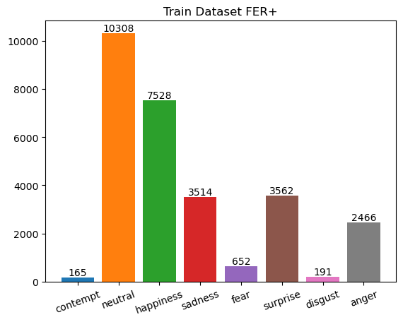
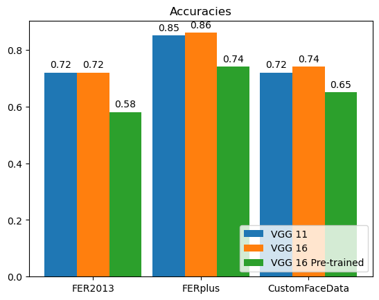

# Facial Emotion Recognition with VGG models
This project trains VGG-11, VGG-16, and a VGG-16 (transfer learning on a pre-trained model) on  various datasets like [FER2013](https://paperswithcode.com/dataset/fer2013), [FER+](https://paperswithcode.com/dataset/fer) and a [custom dataset from Kaggle based on Affectnet](https://www.kaggle.com/datasets/noamsegal/affectnet-training-data), and compare the various model performances.

The models are trained using Pytorch.

Live camera feed and video clips inference using MediaPipe.

## Model Used

### VGG-11

### VGG-16

## Data Visualisation

### FER 2013

### FER+

### Custom Face Data

## Models Training and Evaluation

### Models Accuracy and Loss

### Models Confusion Matrix

### Models F1 Score and Accuracy Score

## Inference of the Model

### Video Clips

https://github.com/Saksham1970/emotion-recognition-vgg/assets/45041294/06275671-2592-451f-8536-29754019c683

https://github.com/Saksham1970/emotion-recognition-vgg/assets/45041294/2c87a046-a8a6-4661-b089-abd0670ced2e

### Live Camera Feed

